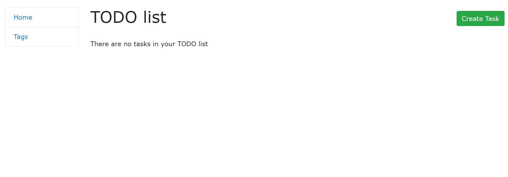
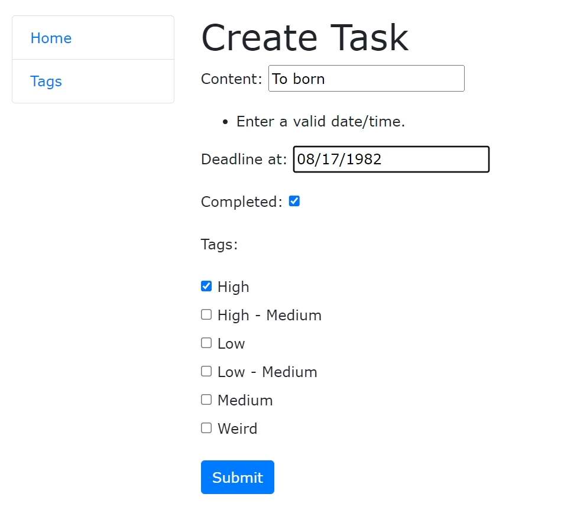
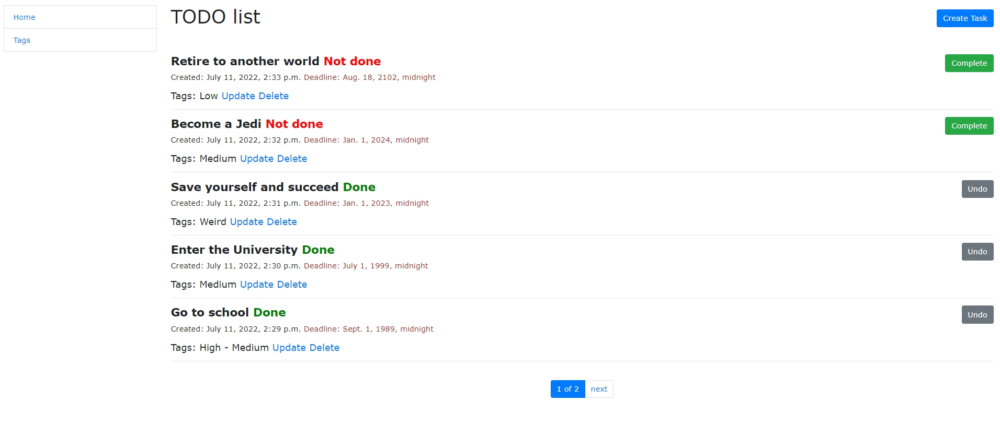
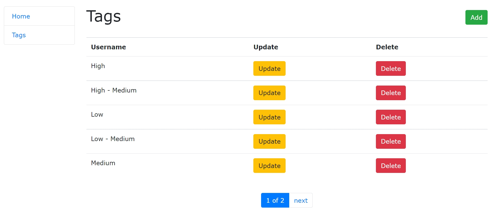

# TODO list

Django project for daily routine in TODO list web-application

## Installation

Python 3 must be already installed

```shell
git clone https://github.com/Aleksei-Isaev/Web-App-TODO-list-for-daily-routine.git
python -m venv venv
source venv/bin/activate - on macOS (venv\Scripts\activate - on Windows)
python manage.py migrations
python manage.py migrate
python manage.py runserver
```

## Features

* Simple and convenient to use
* Set priorities and time
* Lifetime support

## Demo





